## Part 1. Установка ОС
- Установка **Ubuntu 20.04 Server LTS** без графического интерфейса. (Используемая программа для виртуализации — VirtualBox)
- Узнаем версию, выполнив команду`cat /etc/issue`
- 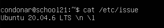

## Part 2. Создание пользователя
- `sudo adduser new-user` - создание пользователя `new-user`
- `sudo usermod -aG adm new-user` - добавление пользователя в группу adm
	- `-a` — (append) добавить к текущим группам, не удаляя из них.
	- `-G` — (groups) список групп.
- Пользователь в выводе команды `cat /etc/passwd`
- 

## Part 3. Настройка сети ОС
- `sudo hostnamectl set-hostname user-1` меняем название машины на `user-1` 
- `exec bash` - перезаходим в систему, чтобы имя обновилось в начале строки  (в приглашении `condonar@user-1`) 
- `timedatectl list-timezones | grep Moscow` - находим точное название временной зоны
- `sudo timedatectl set-timezone Europe/Moscow` - устанавливаем найденную временную зону
- `ls /sys/class/net` - выводим название сетевых интерфейсоф
- 
	- `lo` — локальный интерфейс (loopback).
	- `enp0s3` (или аналогичное, например `eth0`) — это основной сетевой интерфейс в VirtualBox.
- Чтобы получить (обновить) IP-адрес от DHCP-сервера и вывести его в консоль, выполняем следующие действия:
	- `sudo dhclient -r` - сбросить текущий адрес
	- `sudo dhclient` - запросить новый адрес
	- `ip addr show enp0s3` - посмотреть полученный адрес
- 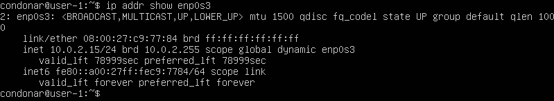
- Число **10.0.2.15** является IP-адресом, полученным от DHCP-сервера VirtualBox.
- **DHCP (Dynamic Host Configuration Protocol)** — это сетевой протокол, позволяющий устройствам автоматически получать IP-адрес и другие параметры (маску подсети, шлюз, DNS) от сервера. Это избавляет от необходимости ручной настройки сети.

- `ip route | grep default` - определение внутреннего IP-адреса шлюза (GW)
- `curl ifconfig.me` - определение внешнего IP-адреса

- `ls /sys/class/net` - находит название сетевого интерфейса
-  `sudo nano /etc/netplan/*.yaml` - открываем этот файл через Netplan и редактируем (вносим настройки)
- `sudo netplan apply` - применяем настройки
- 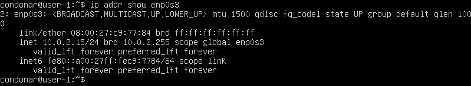
- настройки применились и флаг `dynamic` исчез
- `sudo reboot` - перезагрузка компьютера
- Пинг цифрового и доменного адреса
- 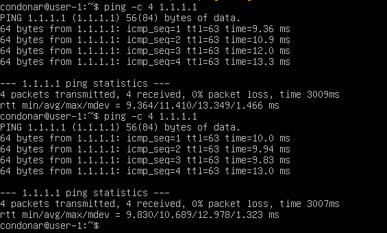

## Part 4. Обновление ОС
- `sudo apt update` - обновление списка пакетов
- `sudo apt upgrade` - установка обновлений
- 

## Part 5. Использование команды **sudo**
- `sudo usermod -aG sudo new-user` - добавление пользователя в группу sudo
- `su new-user` - переключаемся на пользователя `new-user` или `exit` и заходим заново
- `sudo hostnamectl set-hostname new-user-name` - смена hostname (имя машины) на `new-user-name`
- Перезагружаем (или команда `exec bash`) и имя хоста изменится
- 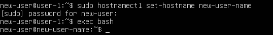
- **sudo (substitute user do)** — это программа, предназначенная для запуска процессов с правами другой учётной записи (по умолчанию — суперпользователя `root`).

## Part 6. Установка и настройка службы времени
- `sudo timedatectl set-ntp true` - убеждаемся что служба синхронизации (NTP) включена
- `sudo systemctl restart systemd-timesyncd` - перезапуск службы для применения настроек
- `date` - вывод времени, `timedatectl` - более детально
- `timedatectl show` - проверка статуса синхронизации
- 

## Part 7. Установка и использование текстовых редакторов
- `sudo apt install vim nano joe -y` - установка редакторов vim, nano, joe

- 
- `VIM`: клавиша `Esc`, затем `:wq` 

- 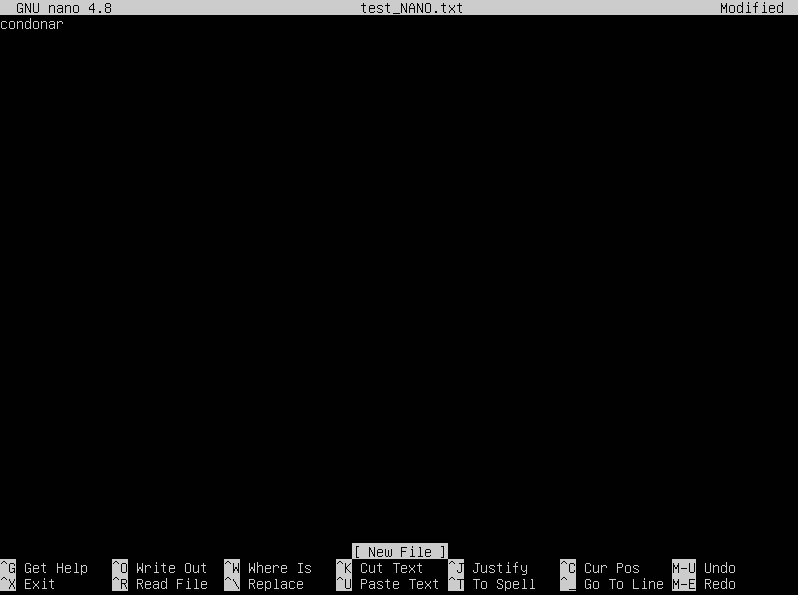
- `NANO`: `Ctrl + o`, нажимаем **Enter** чтобы сохранить, затем `Ctrl + X`

- 
- `JOE`: `Ctrl + K`, затем нажимаем клавишу `X`

- 
- `VIM` выход без сохранения: клавиша `Esc`, затем `:q!`

- 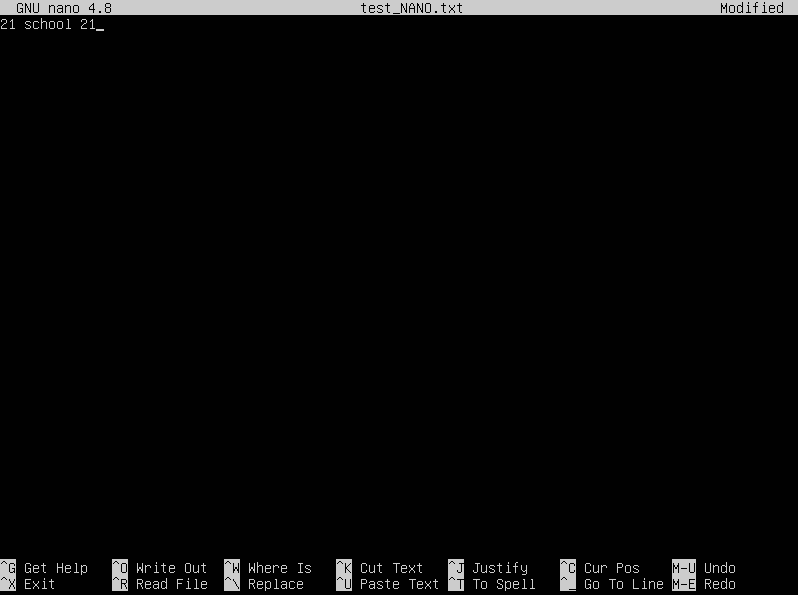
- `NANO` выход без сохранения: `Ctrl + X` , далее выбираем `N`(No)

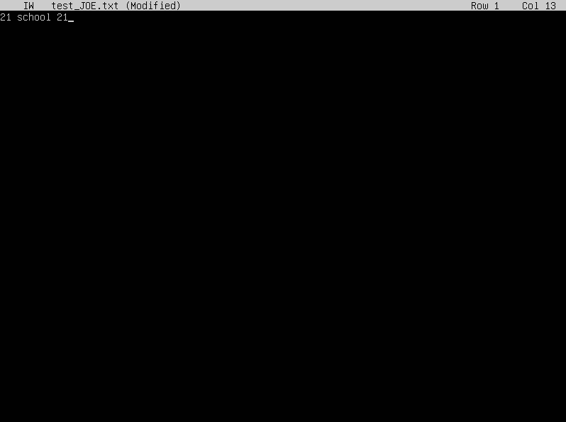
- `JOE` выход без сохранения: `Ctrl + C`, далее нажимаем `y`(yes)

- `VIM` - поиск и замена
- 
- 

- `NANO` - поиск и замена
- 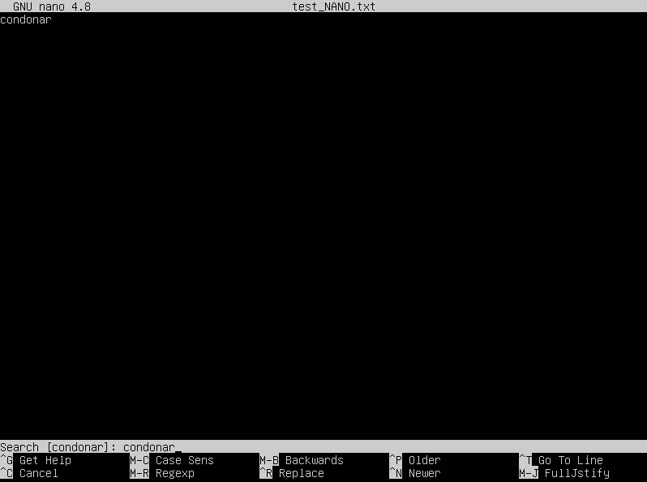
- 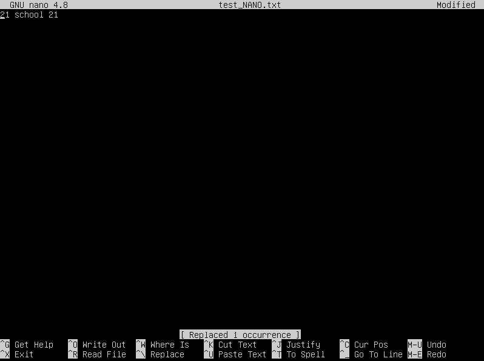

- `JOE` - поиск и замена
- 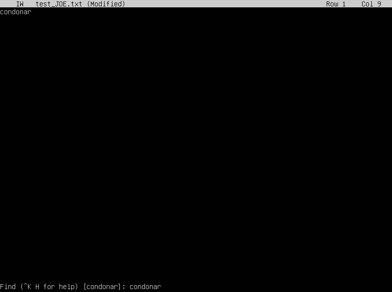
- 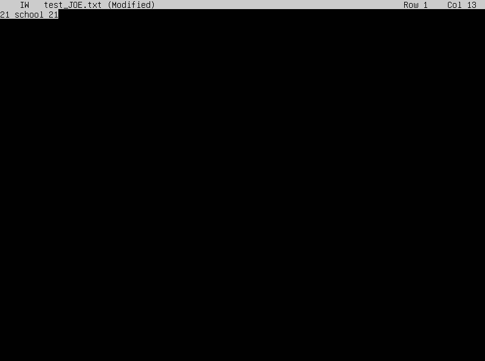

## Part 8. Установка и базовая настройка сервиса **SSHD**
- `sudo apt install openssh-server -y` - установка службы SHHd
- `sudo systemctl enable ssh` - настройка службы автостарта
- `sudo systemctl start ssh` - запуск службы
- Перенастройка порта SHHd на 2022: открываем в `vim` нужный файл `sudo vim /etc/ssh/sshd_config`, надо раскомментировать строку `#Port 22` и заменить ее на `Port 2022`, сохраняем и выходим.
- `sudo systemctl restart ssh` - перезапускаем службу
- `ps aux | grep sshd` - проверка процесса с помощью команды `ps` 
- 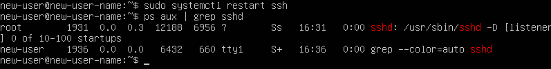
- **Команда `ps` (process status)** — это стандартная утилита в Linux, предназначенная для отображения снимка текущих активных процессов. В отличие от `top`, она выдает статичный список на момент вызова.
**Значение ключей `aux`:**
- - **`a` (all)** — указывает команде вывести процессы **всех пользователей** системы. Без этого ключа `ps` показал бы только процессы, запущенные нами лично, и мы бы не увидели `sshd`, так как он запускается от имени суперпользователя `root`.
- **`u` (user)** — переключает вывод в **пользовательский формат**. Он добавляет важные столбцы: имя владельца процесса (USER), процент использования оперативной памяти (%MEM) и процессора (%CPU), а также время запуска процесса.
- **`x`** — заставляет `ps` выводить процессы, **не связанные с управляющим терминалом** (TTY). Поскольку `sshd` является «демоном» (фоновой службой), он работает в фоне без привязки к конкретному окну консоли. Без ключа `x` такие процессы не отображаются.
- Символ **`|`** (pipe/конвейер) передает весь список процессов команде **`grep`**, которая фильтрует вывод, оставляя только строки, содержащие текст `sshd`. Это позволяет быстро найти нужную службу среди сотен системных процессов.
- Вывод команды `netstat -tan`
- 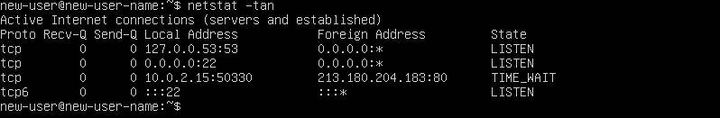
Значение ключей `-tan`:
- **`-t` (tcp)** — отображать только TCP-соединения (именно этот протокол использует SSH).
- **`-a` (all)** — показывать все активные подключения и порты, которые компьютер «слушает» (ожидает входящих соединений).
- **`-n` (numeric)** — показывать адреса и номера портов в **числовом виде**. Без этого ключа команда попыталась бы заменить `2022` на имя службы, а IP-адреса — на доменные имена, что замедляет вывод и менее информативно для отладки.
Значение столбцов вывода:
- **Proto** (`tcp`) — используемый протокол передачи данных.
- **Recv-Q** (`0`) — очередь получения. Количество байт, полученных из сети, но еще не обработанных программой.
- **Send-Q** (`0`) — очередь отправки. Количество байт, которые программа отправила, но они еще не подтверждены принимающей стороной.
- **Local Address** (`0.0.0.0:2022`) — локальный адрес и номер порта, на котором «висит» служба.
- **Foreign Address** (`0.0.0.0:*`) — адрес и порт удаленного компьютера. Звездочка означает, что соединение еще не установлено и сервер готов принять запрос с любого порта.
- **State** (`LISTEN`) — состояние порта. `LISTEN` означает, что служба SSHd активно ожидает новых подключений на указанном порту.
- Адрес **`0.0.0.0`** в контексте сетевого порта (Local Address) означает, что служба SSHd слушает входящие подключения на **всех доступных сетевых интерфейсах** данного устройства.

## Part 9. Установка и использование утилит **top**, **htop**
- `sudo apt install htop` - установили утилиту `htop`, `top` уже установлена
- Вывод команды top
- 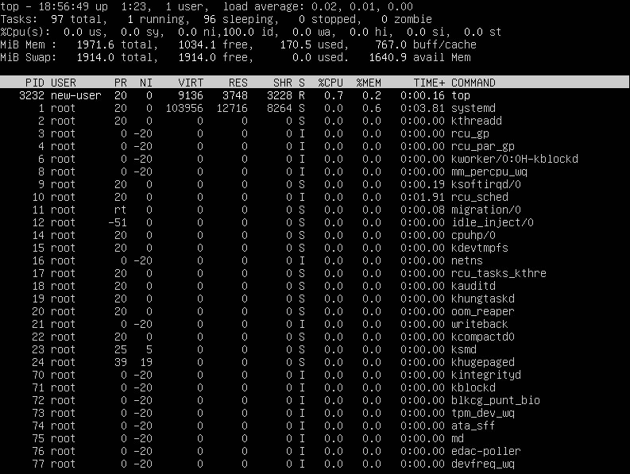
- uptime: `1:23` (1 час 23 минуты)
- количество авторизованных пользователей: `1 user`
- средняя загрузка системы **(load average)**: `0,02, 0.01, 0.00` (среднее количество процессов в очереди за 1, 5 и 15 минут)
- общее количество процессов **(Tasks)**: `97 total`
- загрузка cpu: `0.0 us, 0.0 sy, 0.0 ni, 100.0 id` (использование/система/простой)
- загрузка памяти: `1971.6 total, 1034.1 free, 170.5 used`
- pid процесса занимающего больше всего памяти - `1`
- pid процесса, занимающего больше всего процессорного времени `3232`
- 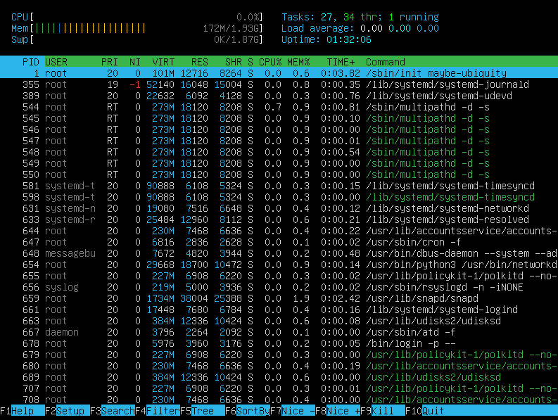
- 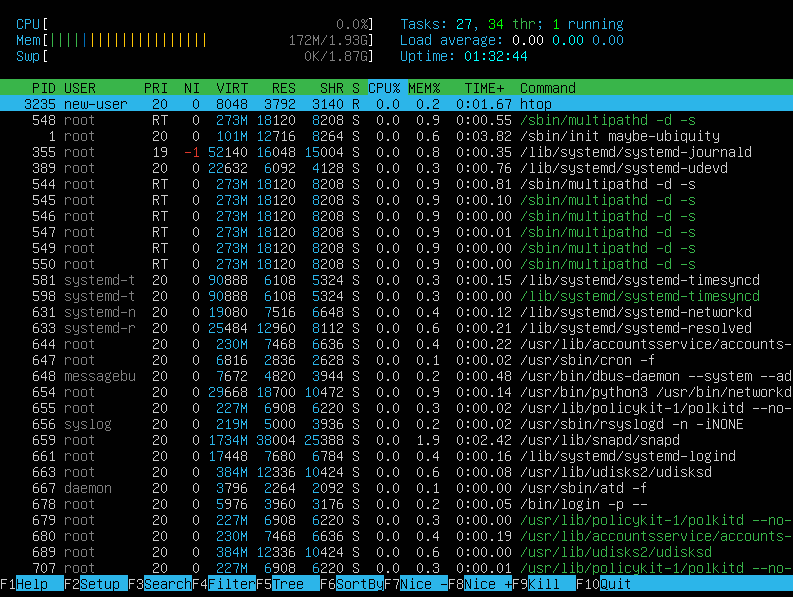
- 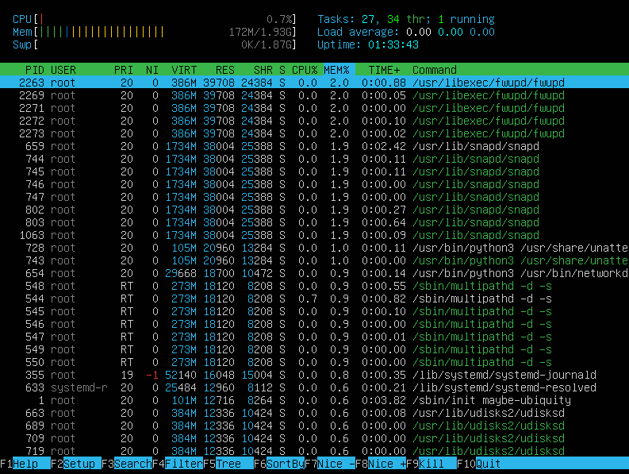
- 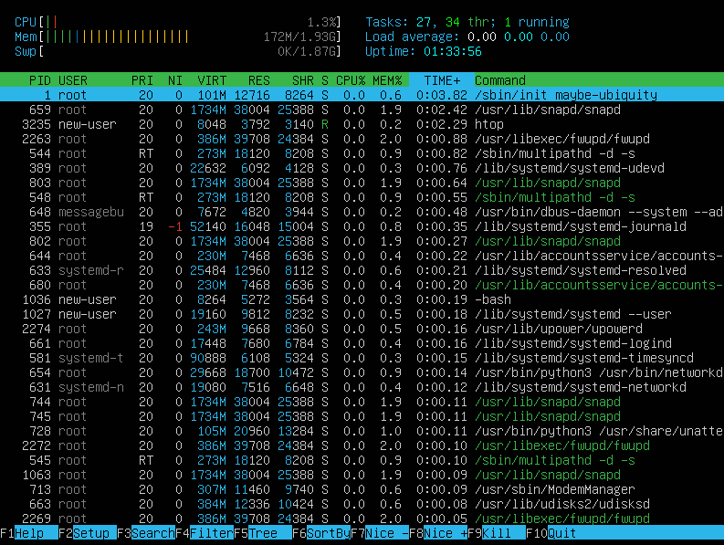
- 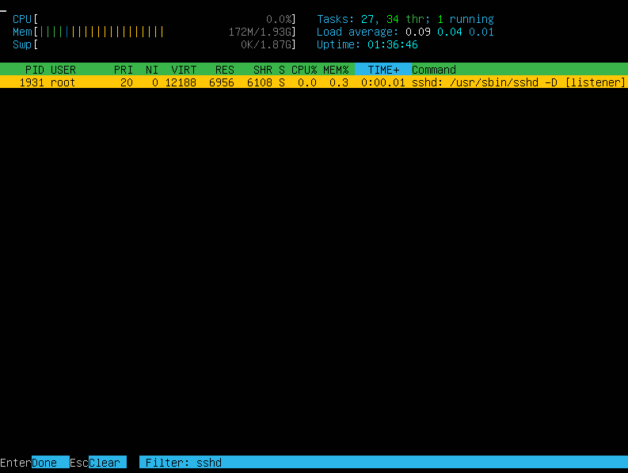
- 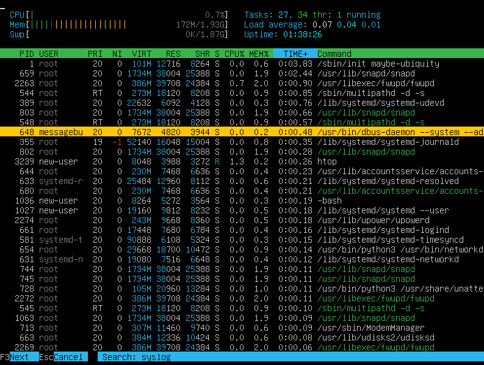
- 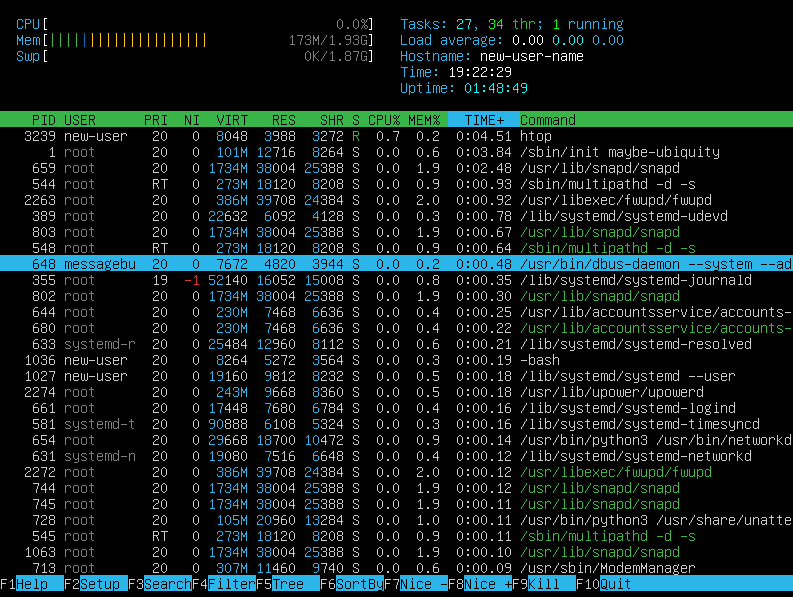

## Part 10. Использование утилиты **fdisk**
- `sudo fdisk -l`
- 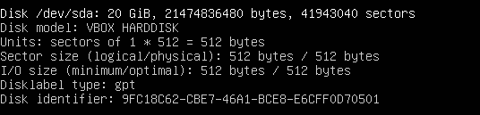
- `Disk /dev/sda` - название
- `20 GiB` - размер
- `41943040` - количество секторов
- 
- `1.9G` - размер swap

## Part 11. Использование утилиты **df**
- `df` Команда **df** (сокращение от _disk free_) — это стандартная утилита в Linux, предназначенная для анализа использования дискового пространства.
- Размер раздела (1K-blocks): `10218772`
- Размер занятого пространства (Used): `4856684`
- Размер свободного пространства (Available): `4821416`
- Процент использования (Use%): `51%`
- В стандартном выводе `df` без ключей единицей измерения являются **килобайты (Kbytes)**. В заголовке это обозначено как `1K-blocks`.
- `df -Th` Ключ `-T` выводит тип файловой системы, а `-h` (human-readable) использует суффиксы K, M, G.
- Размер раздела (1K-blocks): `9.8G`
- Размер занятого пространства (Used): `4.7G`
- Размер свободного пространства (Available): `4.6G`
- Процент использования (Use%): `51%`
- Тип файловой системы (Type): `ext4`

## Part 12. Использование утилиты **du**
- `sudo du -sb /home && sudo du -sb /var && sudo du -sb /var/log` - вывод размера папок в байтах
- `sudo du -sh /home && sudo du -sh /var && sudo du -sh /var/log` - вывод в человекочитаемом виде
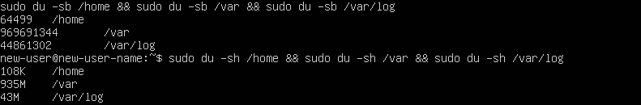

## Part 13. Установка и использование утилиты **ncdu**
- `sudo apt install ncdu` - установка утилиты `ncdu`
- Вывод размера папок: `sudo ncdu /home`, `sudo ncdu /var`, `sudo ncdu /var/log`
- 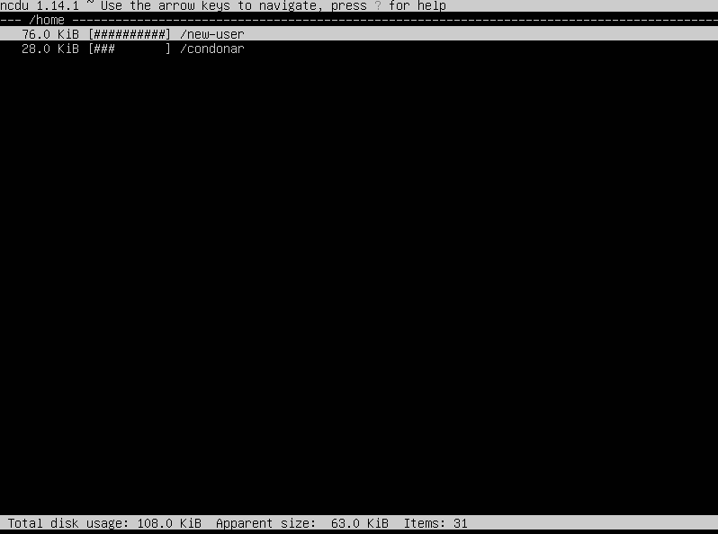
- 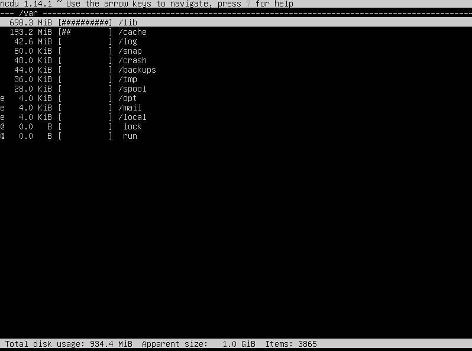
- 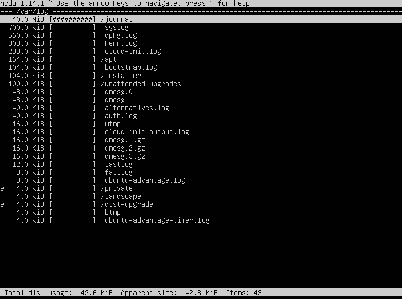

## Part 14. Работа с системными журналами
- Для просмотра используют команду `less` (она позволяет листать текст) или `tail` (чтобы увидеть только конец файла)
- `sudo less /var/log/dmesg` - лог загрузки ядра
- `sudo less /var/log/syslog` - общий системный лог
- `sudo less /var/log/auth.log` - лог авторизации 
- Время последней успешной авторизации: `Jan 21 15:24:10`
- Имя пользователя: `new-user`
- Метод входа в систему: `TTY=tty1`
- `sudo systemctl restart ssh` - перезапуск службы SSHd
- `sudo journalctl -u sshd | tail -n 20` - смотрим отчет о перезапуске службы SHHd в логах
- 

## Part 15. Использование планировщика заданий **CRON**
- Для управления планировщиком заданий в Linux используется утилита **cron**.
- `crontab -e` - создание задания в cron
- В самый конец добавлена строчка `*/2 * * * * uptime` (`*/2` - выполнять каждые 2 минуты, `* * * *` -каждый час, каждый день, каждый месяц и каждый день недели, `uptime` - сама команда, которую мы запускаем)
- `crontab -l` - вывод списка текущих заданий
- 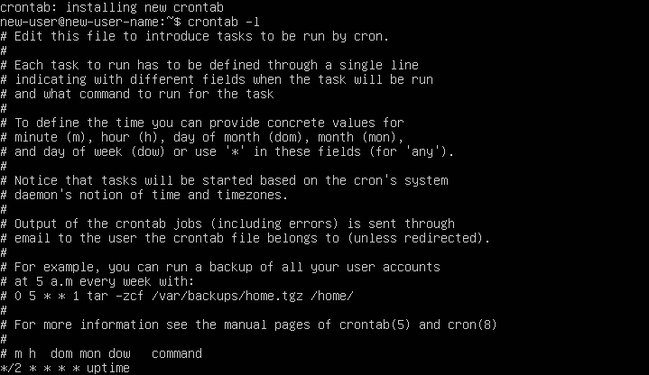
- `sudo grep "CRON" /var/log/syslog | grep "uptime" | tail -n 5` - поиск строк о выполнении в журналах
- 
- `crontab -r` - удаление всех заданий
- `crontab -l` - проверка после удаления
- 
